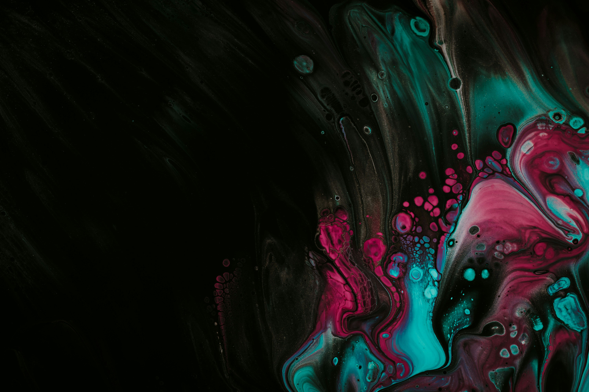
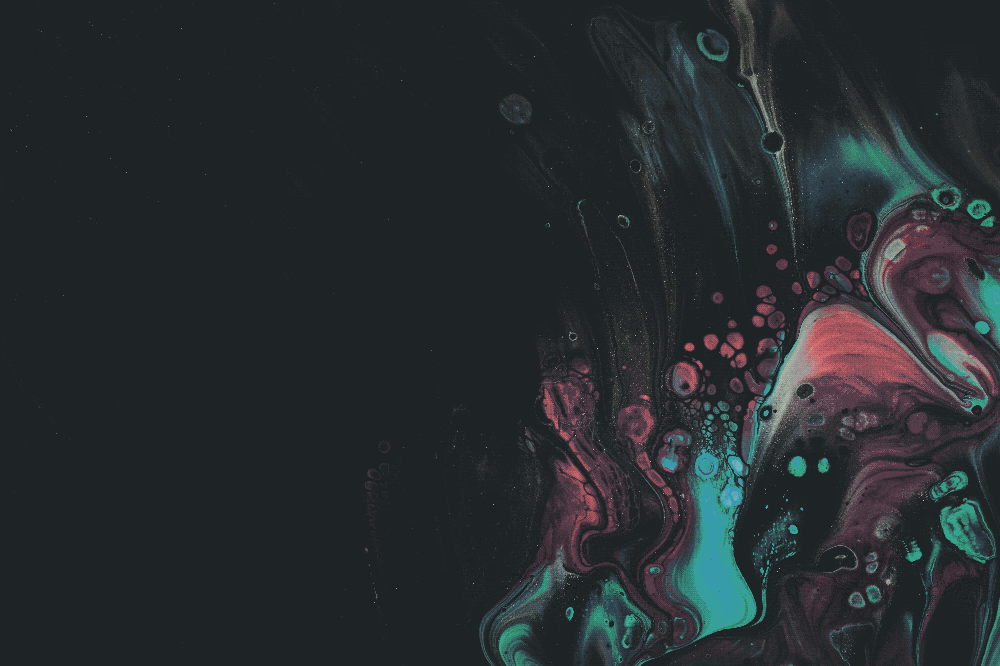
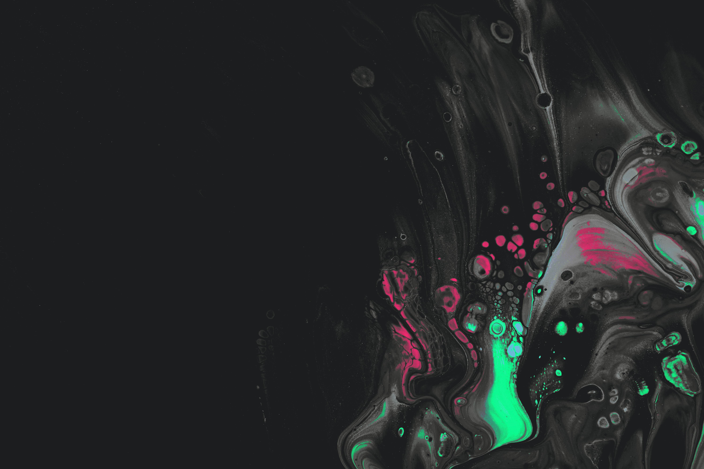
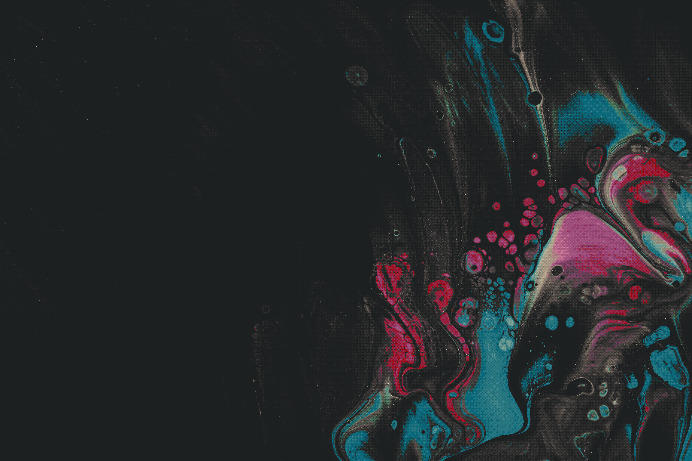
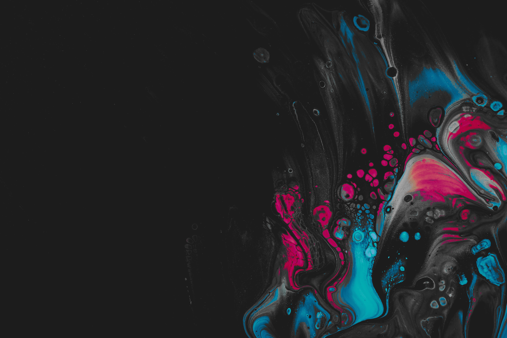
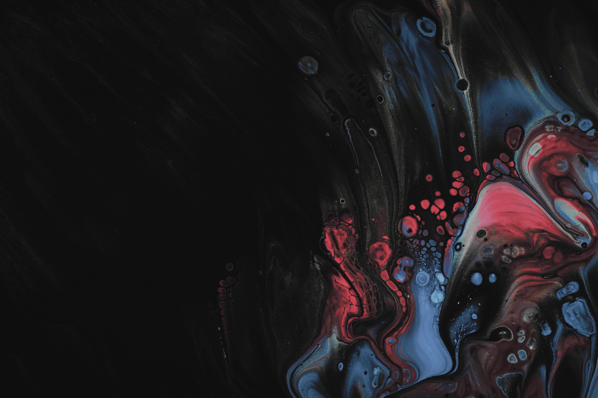
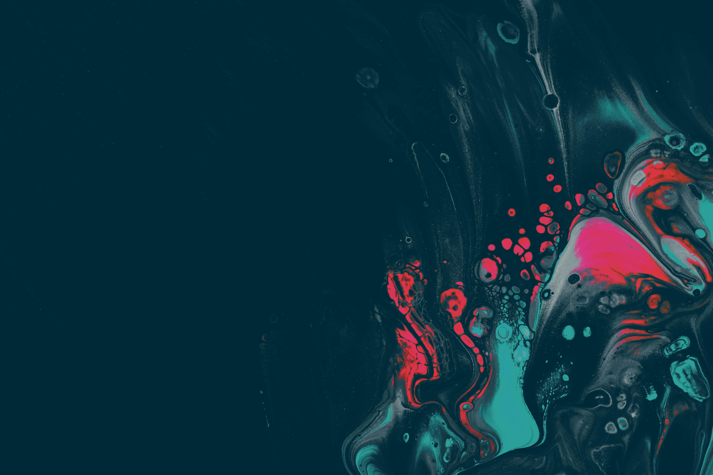

# ReChrome

ReChrome is a CLI that recolors images based on predefined palettes, using Bayer ordered dithering to smooth out the color bands.

## Install
Unfortunately, the binary might be flagged by Windows Defender as a Virus\
To circumvent this, please follow these steps:
- Create a folder in a root directive
- Exclude said folder from Windows Defender
- Unzip ReChrome to that folder

## Help
```c++
Usage: rechrome.exe [OPTIONS] --palette <PALETTE> --input <INPUT>

Options:
  -p, --palette <PALETTE>  Color Palette    [possible values: gray, gruvbox, everforest, kanagawa, molokai, papercut, solarized]
  -d, --dither <DITHER>    Dithering Modes  [default: bayer16] [possible values: none, bayer2, bayer4, bayer8, bayer16]
  -b, --bayer <BAYER>      Bayer amplitude  [default: bayerX * 4]

  -i, --input <INPUT>      Input file path
  -f, --format <FORMAT>    Output file type [default: png] [possible values: png, jpg, jpeg]
  -o, --output <OUTPUT>    Output file path [default: <input>_<palette>_<dither>.<format>]

  -s, --showcase <SIZE>    Show in-terminal (recommended value: <40)
  -r, --runtime            Show timing measurements

  -h, --help               Print help
  -V, --version            Print version
```
### Example usage
Simple conversion\
` <correctDir>.\rechrome.exe -i "C:\Users\<user>\Downloads\flower.jpeg" -p kanagawa`

Conversion with preview\
` <correctDir>.\rechrome.exe -i "C:\Users\<user>\Downloads\flower.jpeg" -p kanagawa -s 15`

Manual dithering (watercolor effect)\
` <correctDir>.\rechrome.exe -i "C:\Users\<user>\Downloads\flower.jpeg" -p kanagawa -d bayer2 -b 128`

In all these examples, ReChrome saves the image to the input directory, appending palette and dithering parameter to the file name.

## Palettes

| [Original](https://unsplash.com/de/fotos/ein-schwarzer-hintergrund-mit-einem-rosa-und-blauen-design-L8fXJgMk5jc) |
| :---: |
|  |

| Palette | Photo | Palette | Photo |
|:---:|:---:|:---:|:---:|
|[Everforest](https://github.com/sainnhe/everforest/blob/master/palette.md9)|  |[Molokai](https://github.com/UtkarshVerma/molokai.nvim)|  |
|[Gruvbox](https://github.com/morhetz/gruvbox)|  |[Papercut](https://github.com/NLKNguyen/papercolor-theme)|  |
|[Kanagawa](https://github.com/rebelot/kanagawa.nvim)|  |[Solarized](https://github.com/solarized/xresources)|  |
