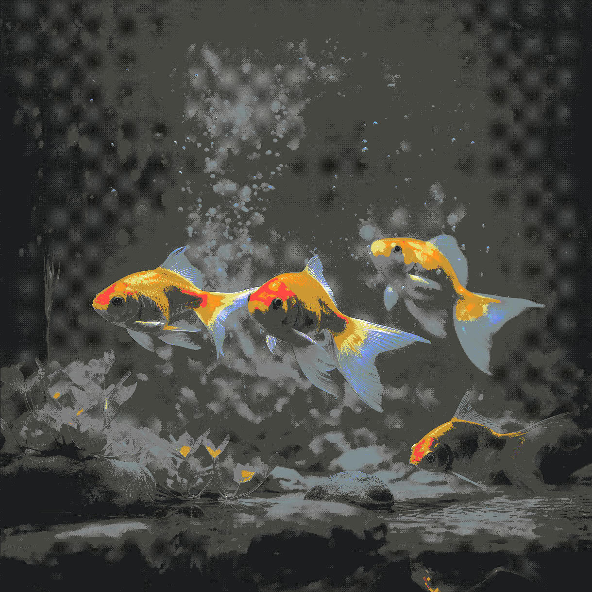
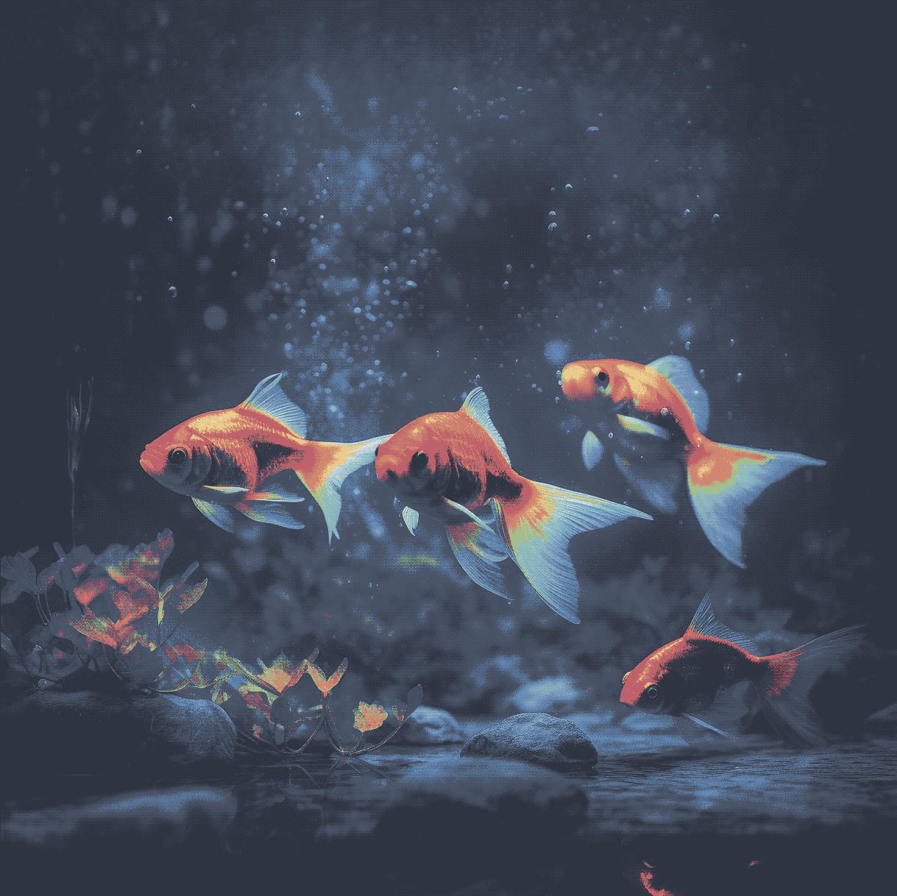
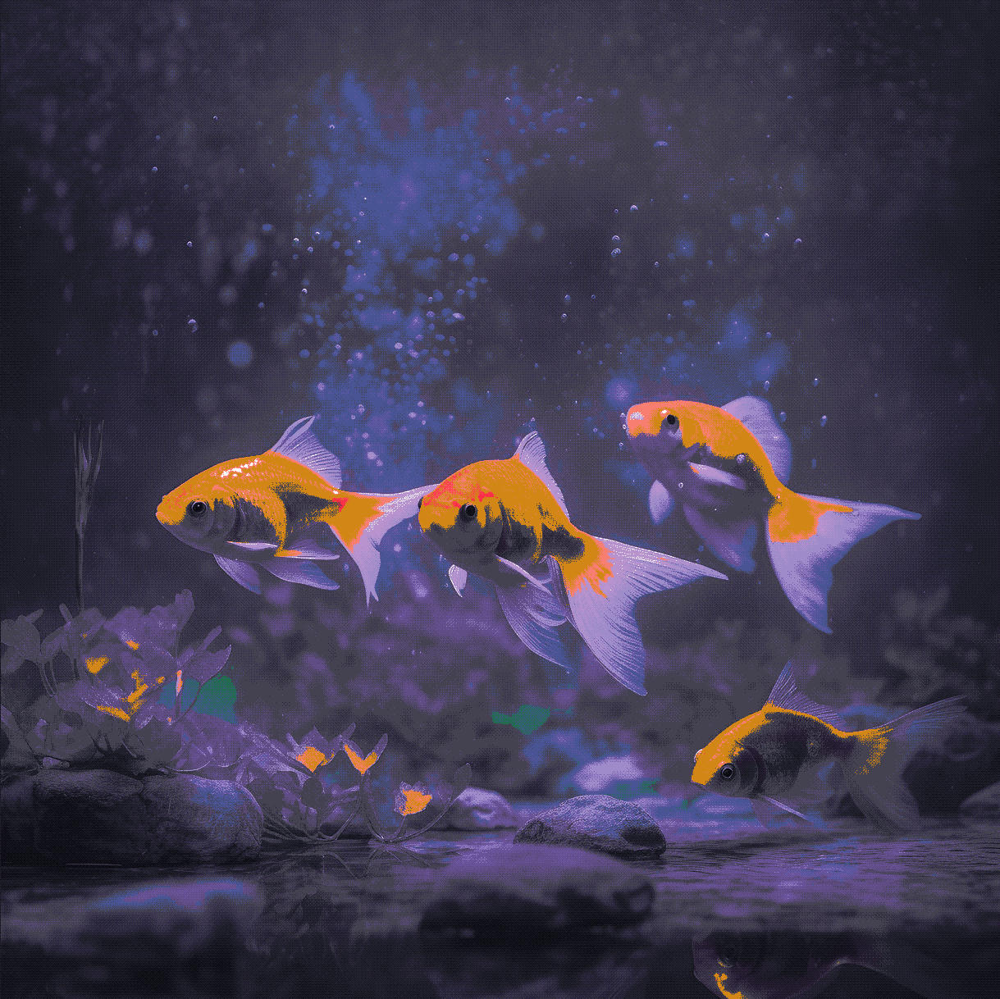
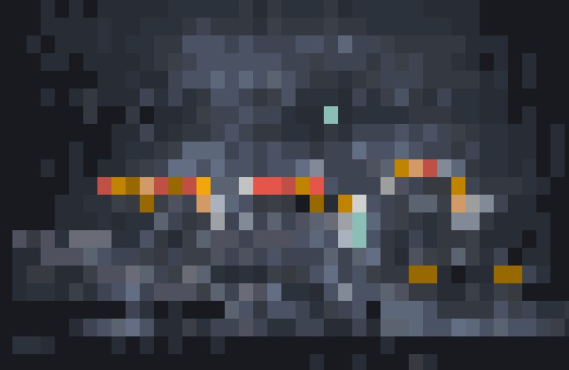
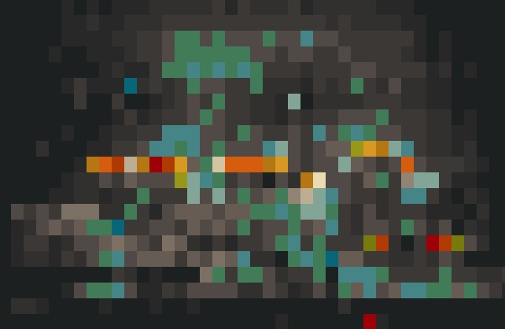
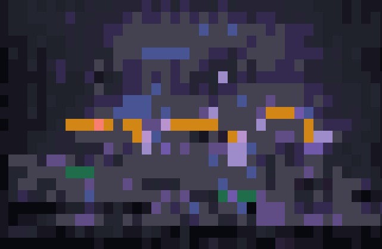

# ReChrome
ReChrome is a command-line tool that recolors images using predefined color palettes and dithering.

It loads an image from the specified input path, applies dithering, performs palette quantization, and writes the processed output file in the desired format.

## 🎨 Palettes
|[Original](https://pixabay.com/photos/goldfish-aquarium-fish-tank-pets-8012081/)|[Atom One](https://github.com/Th3Whit3Wolf/one-nvim/tree/main)|[Catppuccin](https://catppuccin.com/palette/)|[Darcula](https://github.com/doums/darcula)|
|:--:|                                 :---:                                     |                    :---:                    |                      :---:                         |
|||||
|[Everforest](https://github.com/sainnhe/everforest/blob/master/palette.md)|[Gruvbox](https://github.com/morhetz/gruvbox)|[Kanagawa](https://github.com/rebelot/kanagawa.nvim)|[Monokai](https://github.com/UtkarshVerma/molokai.nvim)|
|||||
|[Nord](https://www.nordtheme.com/docs/colors-and-palettes)|[PaperColor](https://github.com/NLKNguyen/papercolor-theme)|[Solarized](https://github.com/solarized/xresources)|[Synthwave](https://github.com/robb0wen/synthwave-vscode)|
|||||

## ℹ️ Arguments
```c++
Usage: rechrome.exe [OPTIONS] --input <INPUT>

Options:
  -p, --palette <PALETTE>  Color Palette    [possible values: atomone, catppuccin, darcula, everforest, gruvbox, kanagawa, monokai, nord, papercolor, solarized, synthwave]
  -d, --dither <DITHER>    Dithering Modes  [default: bayer16] [possible values: raw, bayer2, bayer4, bayer8, bayer16]
  -a, --ampl <AMPL>        Bayer Amplitude  [default: bayerX * 4, <256] 
                           
  -i, --input <INPUT>      Input file path  
  -f, --format <FORMAT>    Output file type [default: jpg] [possible values: png, jpg, jpeg]
  -o, --output <OUTPUT>    Output file path [default: <input>_<palette>_<dither>.<format>]
                           
  -s, --showcase <SIZE>    Show in-terminal (recommended value: <= 20)
  -r, --runtime            Show runtime performance
                           
  -t, --test <TEST>        Test arguments   [possible values: none, palette, dither, amplitude, all]
  -h, --help               Print help
  -V, --version            Print version
```
## 🛠️ Example usage
In all these examples, ReChrome saves the image to the input directory, appending palette and dithering parameter to the file name.\
When converting low-res images, you might see a lot of noise. Using a lower bayer amplitude with `-a 16` can reduce this effect.

>**Simple conversion**\
>` <correctDir>.\rechrome.exe -i "C:\Users\<user>\Downloads\goldfish.jpg" -p atomone`

>**Manual dithering** (watercolor effect)\
>` <correctDir>.\rechrome.exe -i "C:\Users\<user>\Downloads\goldfish.jpg" -p atomone -d bayer2 -a 128`

>**Test image with all palettes**\
>` <correctDir>.\rechrome.exe -i "C:\Users\<user>\Downloads\goldfish.jpg" -t palette`

>**Conversion with preview in-terminal** (examples below)\
>` <correctDir>.\rechrome.exe -i "C:\Users\<user>\Downloads\goldfish.jpg" -p atomone -s 22`
> ||||
>| :---: | :---: | :---: |

## 📦Install
Download the most recent release under the "Releases" Section on the right hand side, then unzip it and use it in your terminal

Unfortunately, the binary might be flagged by Windows Defender as a Virus\
To circumvent this, please follow these steps:
- Create a folder in a root directive
- Exclude said folder from Windows Defender
- Unzip ReChrome to that folder
